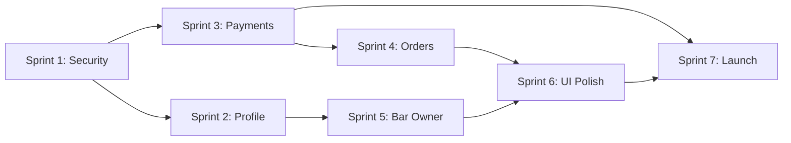

# 🗺️ Dobar Ecosystem Roadmap (DBE_ROAD)

> **Created:** February 16, 2026
> **Last Updated:** February 16, 2026
> **Scope:** Cross-repository — barz (FE), barz-backend (BE), dobar-payment-engine (DPE)
> **Owner:** Carlos Alves — Solo Developer

---

## 📋 Executive Summary

This roadmap covers the path from current MVP state to production-ready launch across three repositories. Work is organized into **Sprints** with clear priorities, dependencies, and acceptance criteria. Each sprint targets a 2-week cycle.

### Current State (Feb 2026)

| Component | Status |
|-----------|--------|
| **barz (Flutter)** | Cart, menu, bar discovery, map navigation, check-in, bundle promotions — functional |
| **barz-backend (FastAPI)** | Auth, orders, cart sync, menus, trending, legal docs, promotions — deployed on Fly.io |
| **dobar-payment-engine** | Gateway routing, Stone/Stripe/PayPal gateways, PIX — tested locally, not deployed |

### What's Missing for Launch

| Gap | Risk Level | Repo |
|-----|-----------|------|
| MFA / Account Security | 🔴 Critical | BE + FE |
| Real Payment Integration | 🔴 Critical | DPE + FE |
| Credit Card Management | 🔴 Critical | BE + FE |
| Order Tracking Post-Checkout | 🟡 High | FE |
| Profile Tab (real) | 🟡 High | FE |
| Bar Owner Web Refinement | 🟡 High | FE |
| API Endpoint Authentication | 🟡 High | BE |
| DPE Production Deployment | 🔴 Critical | DPE |
| Marketing / Launch Material | 🟢 Medium | External |

---

## 🏗️ Sprint Plan

### Sprint 1 — Security & Auth Foundation (Priority 🔴)

> **Goal:** Make auth production-ready with MFA, account recovery, and API security.

#### barz-backend
- [x] Implement MFA layer (TOTP via authenticator apps + SMS fallback)
- [x] Account recovery flow (since auth is Google/SMS/Apple — recovery = re-verify identity via alternative method)
- [x] User data exclusion endpoint (LGPD/GDPR compliance — `DELETE /me/data`)
- [x] API endpoint authentication (service-level auth: ensure only our apps hit the API)
- [x] Rate limiting on auth endpoints

#### barz (Flutter)
- [ ] MFA setup screen (QR code for authenticator app, SMS verification)
- [ ] MFA challenge screen (on login when MFA is enabled)
- [ ] Account recovery flow UI
- [ ] Biometric auth option (Face ID / fingerprint as device-level shortcut)

#### Acceptance Criteria
- User can enable MFA from profile settings
- Login with MFA-enabled account requires second factor
- User can recover account via alternative auth method
- API rejects unauthenticated requests from unknown clients
- User can request full data exclusion

---

### Sprint 2 — Profile & User Settings (Priority 🟡)

> **Goal:** Transform dummy profile tab into a complete user account hub.

#### barz (Flutter)
- [ ] Profile tab — user account data (name, email, phone, photo)
- [ ] App settings section (light/dark mode toggle, language preference)
- [ ] Notification settings (push notifications, order updates, promotions)
- [ ] Privacy settings (data sharing preferences, location permissions)
- [ ] Help center (FAQ, contact support, bug report)
- [ ] Logout with confirmation
- [ ] "Delete My Account" flow (calls `DELETE /me/data`)

#### barz-backend
- [ ] `PUT /me/profile` — update profile fields
- [ ] `GET /me/notification-preferences` / `PUT /me/notification-preferences`
- [ ] `GET /me/privacy-settings` / `PUT /me/privacy-settings`

#### Acceptance Criteria
- Profile tab displays real user data
- Dark mode toggle persists and works globally
- User can configure notification preferences
- Logout clears all local state and tokens

---

### Sprint 3 — Payment Integration (Priority 🔴)

> **Goal:** Real payments working end-to-end with credit card management.

#### dobar-payment-engine
- [ ] Production deployment to Fly.io
- [ ] Configure shared secret for BE ↔ DPE auth
- [ ] Fix PIX BR Code generation
- [ ] Add customer data to DPE schema (required for PagarMe)
- [ ] Sandbox integration tests passing in CI
- [ ] Versioning and package structure finalized

#### barz-backend
- [ ] Credit card CRUD endpoints (`POST/GET/DELETE /me/cards`)
- [ ] Card tokenization flow (tokens stored, not raw card data)
- [ ] Integration with DPE for real payment processing
- [ ] Webhook listener for async payment confirmations

#### barz (Flutter)
- [ ] Credit card management screen (add/edit/delete cards)
- [ ] Card input UI with validation (Luhn, expiry, CVV)
- [ ] PIX payment modal (display QR code, copy-paste brcode)
- [ ] Apple Pay integration (iOS)
- [ ] Google Pay integration (Android)
- [ ] Checkout page refinement — connect to real payment flow
- [ ] Payment confirmation / failure screens

#### Acceptance Criteria
- User can add, view, and delete credit cards
- User can pay via PIX, card, Apple Pay (iOS), Google Pay (Android)
- Payment flows through DPE to real gateways (sandbox mode)
- Failed payments show clear error messages
- Successful payment creates confirmed order

---

### Sprint 4 — Order Lifecycle (Priority 🟡)

> **Goal:** Complete the post-checkout experience.

#### barz (Flutter)
- [ ] Order tracking screen (WebSocket-powered real-time status)
- [ ] Order status states: confirmed → preparing → ready → picked up
- [ ] Push notification on status change
- [ ] Order history in profile
- [ ] Receipt / order summary view

#### barz-backend
- [ ] Ensure WebSocket order status is production-stable
- [ ] Order history endpoint with pagination
- [ ] Push notification integration (FCM for Android, APNs for iOS)

#### Acceptance Criteria
- After checkout, user sees live order status
- User receives push notification when order is ready
- Order history shows all past orders with details

---

### Sprint 5 — Bar Owner Experience (Priority 🟡)

> **Goal:** Refine business_shell for bar owners, especially web.

#### barz (Flutter — Web)
- [ ] Responsive web layout for login_page (centered, proper widths, web-appropriate margins)
- [ ] Campaign/promotions management redesign
- [ ] Bar switch redesign (for multi-bar staff)
- [ ] Logout option in business dashboard
- [ ] VIP/Pro plans screen (view plans, upgrade/downgrade)

#### barz-backend
- [ ] Pro plan subscription endpoints
- [ ] Campaign analytics endpoints
- [ ] Multi-bar staff role management

#### Acceptance Criteria
- Web login looks professional (not stretched mobile layout)
- Bar owners can manage promotions from dashboard
- Bar switch works cleanly for multi-bar staff
- Pro plan info displayed with upgrade CTA

---

### Sprint 6 — Check-in & UI Polish (Priority 🟢)

> **Goal:** Refine the check-in experience and overall UI quality.

#### barz (Flutter)
- [ ] Check-in page UI/UX redesign (leverage Stitch/Canva MCP for design)
- [ ] Checkout page UI polish
- [ ] Pro plans alerts/modals for regular users
- [ ] Dobar Pro workflow (subscribe, benefits display, badge)

#### Acceptance Criteria
- Check-in flow feels smooth and premium
- Pro plan benefits clearly communicated in-app
- UI follows Dobar brand guidelines consistently

---

### Sprint 7 — Launch Preparation (Priority 🟡)

> **Goal:** Infrastructure validation and marketing materials.

#### barz-backend
- [ ] Fly.io scaling validation (100 → 1,000 → 10,000 users simulation)
- [ ] Redis scaling assessment
- [ ] Database performance under load
- [ ] Monitoring and alerting setup

#### dobar-payment-engine
- [ ] Security audit (PCI compliance check, token handling review)
- [ ] Production gateway configuration
- [ ] Payment reconciliation reports

#### Marketing / External
- [ ] Use Firecrawl MCP to scrape bar contacts in MG, RJ, SP
- [ ] Landing page (Dobar for Bar Owners)
- [ ] Email campaign templates
- [ ] Video/image marketing material (Canva/Gamma)
- [ ] All material references business model and value proposition

#### Acceptance Criteria
- Platform handles 10,000 concurrent users without degradation
- Marketing material ready for outreach to 100+ bars
- Landing page live and collecting sign-ups

---

## 🔗 Cross-Repository Dependencies

**Critical Path:** Security → Payments → Orders → Launch

---

## 📌 Notes

- "Forgot Password" is not applicable since auth is Google/SMS/Apple — the equivalent is account recovery via alternative verified identity
- MFA is required since we handle payments and store card tokens
- DPE must be deployed before any real payment testing
- Pro plans logic references `barz-backend/.docs/business` for plan tiers and pricing
